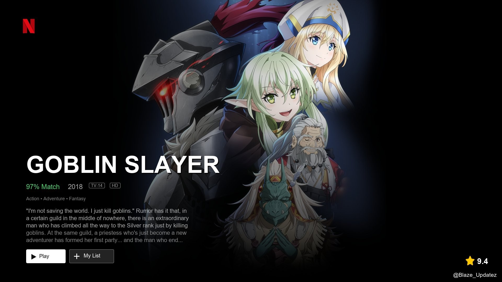
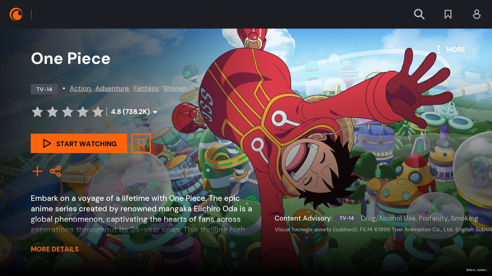
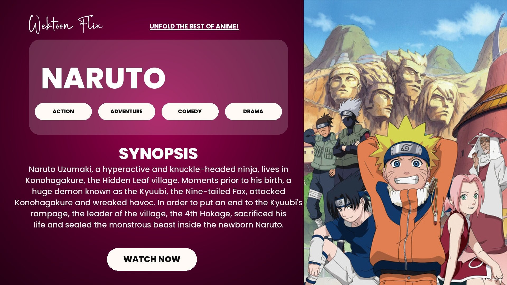
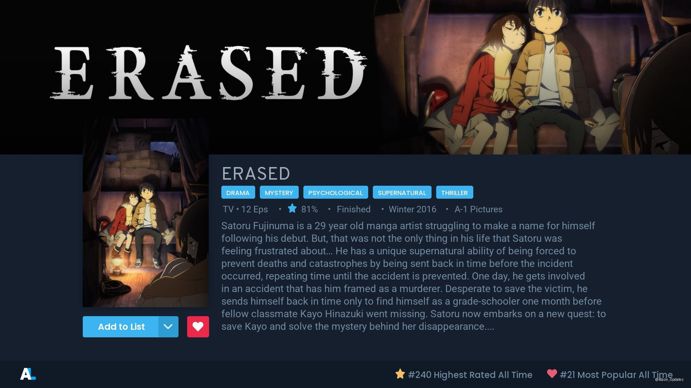
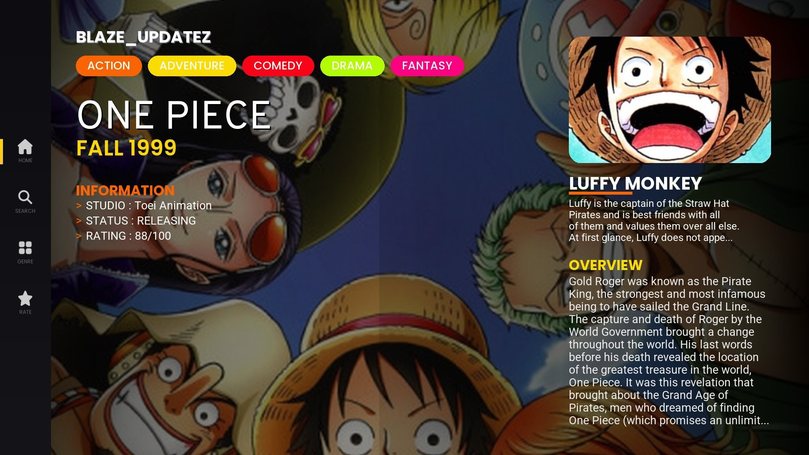
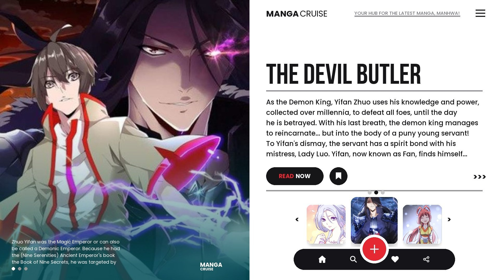

# Postermaking Bot 🎨

A comprehensive Telegram Bot for generating stunning Anime and Manga posters using high-quality templates and data from **AniList** and **Crunchyroll**.

---

## 📋 Table of Contents

- [Features](#-features)
- [Screenshots](#-screenshots)
- [Deployment Guide](#-deployment-guide)
  - [Prerequisites](#prerequisites)
  - [Installation](#installation)
- [Configuration](#-configuration)
- [Running the Bot](#-running-the-bot)
- [Customization](#-customization)
- [Commands](#-commands)
- [Credits](#-credits)

---

## ✨ Features

- **Edge Worker Integration**: Offloads complex data fetching and scraping to high-performance Cloudflare Workers.
- **Advanced AniList Support**: Support for anime/manga search and deep metadata via the AniList Edge Worker.
- **Crunchyroll Integration**: Automated auth and fuzzy search via the Crunchyroll Edge Worker.
- **Premium Tier System**: Support for user plans (Bronze, Silver, Gold) with custom task limits.
- **Image Processing**: Advanced image manipulation using Pillow and NumPy for gradients, rounded corners, and color extraction.
- **Database Support**: MongoDB integration for tracking user plans and usage.

## 📸 Screenshots

<p align="center">
  
  
  
  
  
  
</p>

## 🚀 Deployment Guide

### Prerequisites

- Python 3.9 or higher.
- A Telegram Bot token from [@BotFather](https://t.me/BotFather).
- `API_ID` and `API_HASH` from [my.telegram.org](https://my.telegram.org).
- A MongoDB database.

### Installation

1. **Clone the repository**:

   ```bash
   git clone https://github.com/Blaze-UpdateZ/postermaking.git
   cd postermaking
   ```

2. **Install dependencies**:
   ```bash
   pip install -r requirements.txt
   ```

### Configuration

Configure the bot using environment variables. You can create a `.env` file or export them directly:

| Variable                 | Description                         |
| ------------------------ | ----------------------------------- |
| `API_ID`                 | Your Telegram API ID                |
| `API_HASH`               | Your Telegram API Hash              |
| `BOT_TOKEN`              | Your Telegram Bot Token             |
| `MONGO_URL`              | MongoDB Connection URL              |
| `OWNER_ID`               | Your Telegram User ID (Owner)       |
| `ANILIST_WORKER_URL`     | URL of your AniList Edge Worker     |
| `CRUNCHYROLL_WORKER_URL` | URL of your Crunchyroll Edge Worker |

### Running the Bot

#### Using Python

```bash
python bot.py
```

#### Using Docker

```bash
docker build -t poster-bot .
docker run -e API_ID=12345 -e API_HASH=your_hash ... poster-bot
```

## 🛠️ Customization

- **Templates**: New templates can be added in the `templates/` directory.
- **Fonts**: Place custom `.ttf` or `.otf` fonts in the `fonts/` directory.
- **Icons**: Icons for the UI are located in `iconspng/`.

## 📖 Commands

**General:**

- `/start` - Initialize the bot.
- `/help` - See available commands.
- `/my_plan` - Check your current subscription status.
- `/plans` - View available premium plans.

**Poster Generation:**

- `/ani <query>` - Generate an AniList Anime Poster.
- `/anim <query>` - Generate an AniList Manga Poster.
- `/crun <query>` - Generate a Crunchyroll Anime Poster.
- `/net <query>` - Generate a Netflix Anime Poster.
- `/netm <query>` - Generate a Netflix Manga Poster.
- `/light <query>` - Generate a Light Simple Anime Poster.
- `/lightm <query>` - Generate a Light Simple Manga Poster.
- `/dark <query>` - Generate a Dark Simple Anime Poster.
- `/darkm <query>` - Generate a Dark Simple Manga Poster.
- `/netcr <query>` - Generate a Netflix x Crunchyroll Poster.
- `/mod <query>` - Generate a Modern Anime Poster.
- `/modm <query>` - Generate a Modern Manga Poster.

**Owner Commands:**

- `/broadcast <msg>` - Broadcast Message.
- `/add_premium <id> <plan>` - Add Premium User.
- `/remove_premium <id>` - Remove Premium User.

## 🤝 Credits

- **Powered by**: [@Blaze_Updatez](https://t.me/Blaze_Updatez)
- **Created by**: [@Bharath_boy](https://t.me/Bharath_boy)

---

_Disclaimer: This project is for personal use and educational purposes. Ensure compliance with the Terms of Service of all data providers used._
